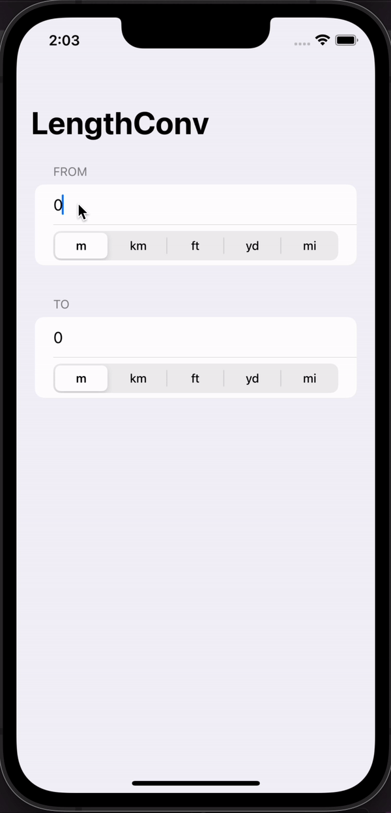
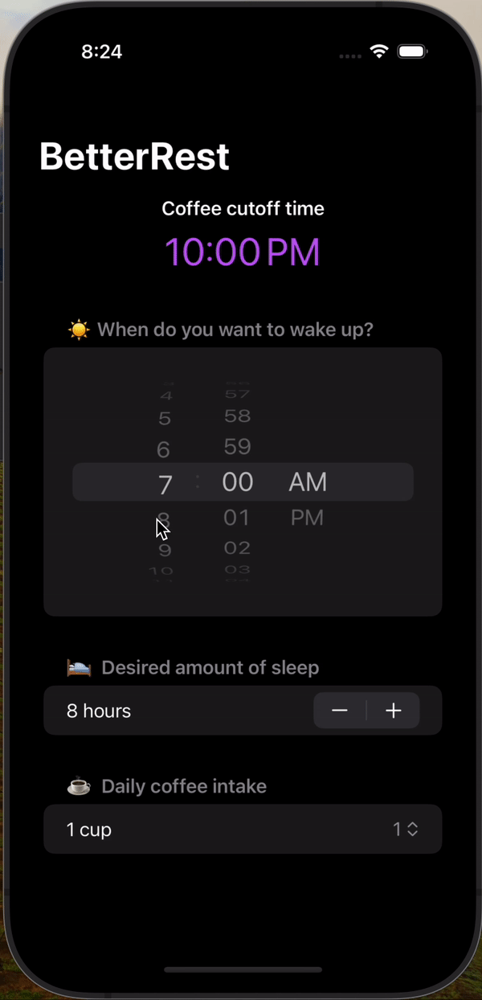

# 100-Days-SwiftUI

This is a repository to keep track of the projects done while following the [Paul Hudson’s 100 Days of SwiftUI course](https://www.hackingwithswift.com/100/swiftui).

## Projects

- [Project 1: WeSplit](WeSplit)

  

 
 

- [Challenge 1: Unit Conversion App](ChallengeDay19)

  

 
 

- [Project 2: GuessTheFlag](GuessTheFlag)

  

 
 

- [Milestone Project 1: RockPaperScissors](RockPaperScissors)

  

 
 

- [Project 4: BetterRest](BetterRest)

  

 
 
